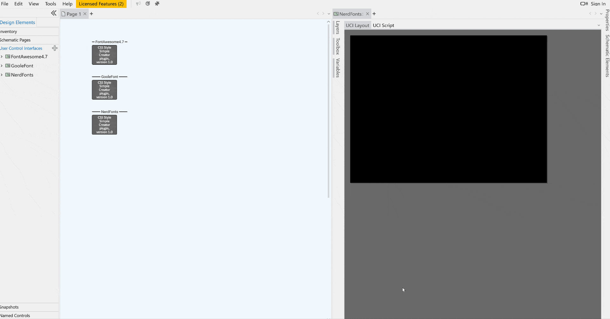

Q-SYS Plugin: CSS Style Simple Creator

This module is designed to select a specific style, manage its associated CSS classes,
and create a new CSS file based on the selected CSS classes.

1. Retrieve Styles: Gather available style names from a specified directory and present them to the user as choices.
2. Style Selection Handling: Load CSS data related to the selected style and extract class names from it.
3. Class Name Selection: Apply the extracted class names to an icon list, enabling users to choose classes.
4. Previous/Next Page Application: Allow users to navigate through previous or next page of classes within the icon list.
5. CSS Update: Update the new CSS with CSS blocks containing the selected classes.
6. Add and Clear Class Names: Offer functionality to add new class names and clear the CSS.
7. Generate CSS File: Create a new CSS file based on the selected style. 
*Note: This plugin may not apply CSS correctly on the scheme page, so please copy and paste it to a UCI page for usage.

The required operating environment is QSD8.1.1 or later with a version of CSS that is compatible.

